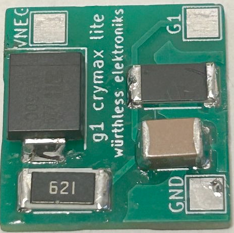
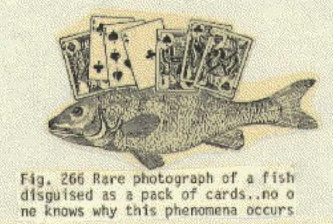
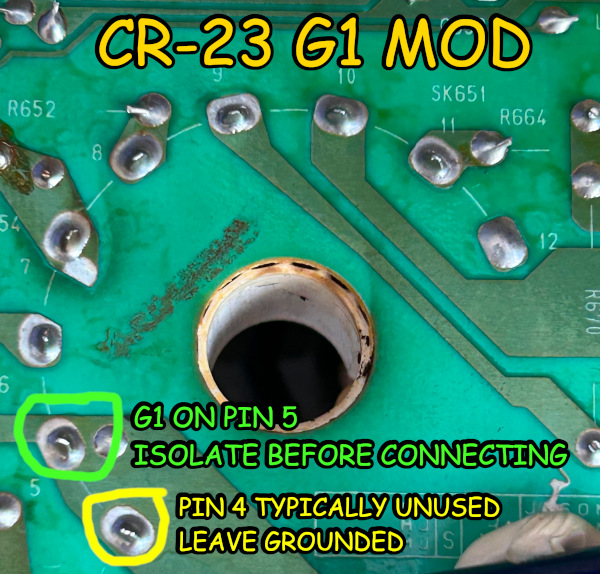
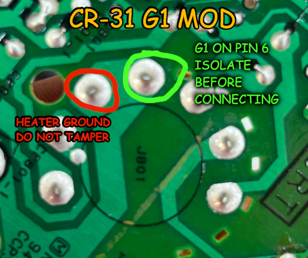
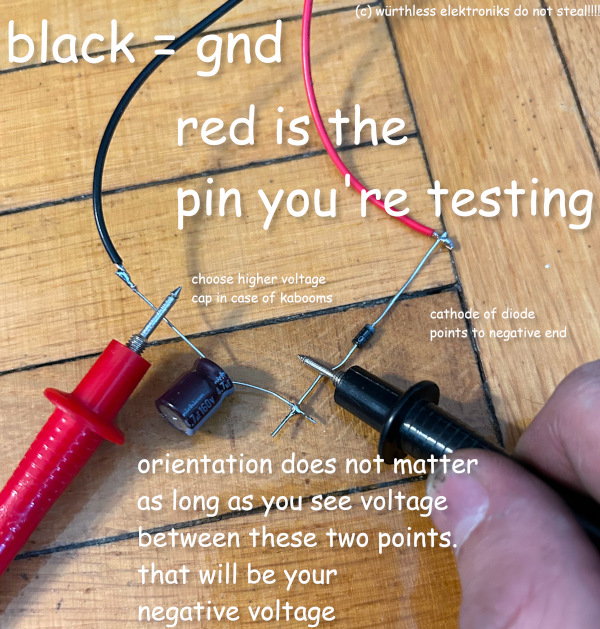

# G1 negative voltage generation circuit for CRT displays

This circuit is a general purpose mod for CRT displays, allowing negative voltages to be applied to the G1 pin to help
fine-tune the display's brightness and sharpness, especially when used with a tube that wasn't intended for use with
that specific design. It also has the bonus of improving picture quality on consumer-level CRT televisions even over
composite.

This, of course, is a fancy way of saying "here's my shitty amateurish take on a circuit that every CRT hobbyist has built already".

Circuit is analog so you only get the Gerbers.

## WARNING: CRTS ARE DANGEROUS

Obligatory CRT health and safety warnings:

* Do not poke the CRT's butthole or you will get shit on. Make sure to discharge the CRT before performing any sort of action on, in, or around its butthole. Otherwise, something to the tune of 25 to 35 kV will go through your body, causing injury and/or death. Remember that CRTs, as well as other capacitive devices inside your display, can hold painful and occasionally lethal high voltages long after the power has been turned off. **Don't poke the chassis when it's live, either!**
* Do not apply pressure to the glass of the CRT. If the CRT is punctured, it will explode, and glass will spray everywhere, causing serious injury to the eyes and genitals. If you value your eyes and dick, wear protective safety gear when transporting a CRT.
* Many CRT displays, particularly from the 1980s and earlier, do not isolate their chassis from the mains, presenting a serious fire and shock hazard. When in doubt, use an isolation transformer.
* Do not hold the CRT by the neck except if you are really drunk, Australian, and have nothing else you can use in a bar fight.
* Other things may happen as a result of using this mod that will cause smoke and kabooms. This means that...
* **THESE FILES ARE PROVIDED TO YOU WITH ABSOLUTELY NO WARRANTY OR SUPPORT, OR ANY GUARANTEE THAT IT WILL WORK AT ALL.** It's up to you to decide if it's safe or not to install. Use it at your own risk!

## Why?

Enterprising jänkermeisters may be aware that cathode ray tubes, once a venerable display device, are no longer being manufactured.
The ones that are often in operation in arcade monitors are burned to a crisp with the HUDs and mazes of the games of yesteryears.
Other times, a tube will die, and a replacement must be sourced from a donor display. Frequently, a tube must be used with an
arbitrary chassis, and although most tubes have standardized voltages (25 kV for 19" tubes, heater voltage usually 6.3 volts),
the G2 (SCREEN) and G3 (FOCUS) voltages can vary between tubes. The result will be a picture that is too bright (G2 voltage
too high) or out of focus (G3 voltage not exact). The usual way to hack around this is by adjusting the B+ voltage, but this
can cause the chassis to run too hot, or possibly cause cathode poisoning if the voltages dip too low.

The CRT, being a vacuum tube, emits electrons from its cathodes before they are accelerated towards the screen at near light speed.
Before that happens, there are several grids used to focus the beam. Similar to the tetrode and other multi-grid tubes, CRTs have a
control grid on the G1 pin which is used to limit the flow of electrons into the next two grids. Most displays, however, do not use
the G1 pin, and simply tie it to ground (i.e., 0 volts), allowing electrons to fire at the screen in an unrestricted manner.
If a negative voltage is placed on G1, then it will limit how many electrons strike the screen. While this will make the screen darker,
it also allows us to fine-tune the SCREEN and FOCUS values, and, as a bonus, we can create a much tighter focused electron beam,
resulting in a sharper and more vivid picture.

It just so happens that many displays have large negative voltages present on their flyback transformer, but they can't be fed
directly to the G1 pin because it won't be stable (or even safe). So, it's time to fix that.

This is a follow-on project to [Hatsune Mike's infamous Nanao MS9 G1 mod](https://mikejmoffitt.com/pages/ms9-hax/#g1mod), which I
had to do to convert my Wells Gardiner WGM2775 to a MS9 chassis. The circuit it implements is roughly the same way the MS9 does it
(if Nanao had implemented the circuit): diode, current limiting resistor, capacitor, discharge resistor. However, it's also possible
to add a potential divider and potentiometer to the circuit to help fine-tune the voltages.

## Schematic

Fairly straightforward circuit. We pick a pin on the flyback that outputs a suitable negative voltage and route it to VNEG. In the simplest case,
a blocking diode between VNEG and ground keeps the voltage we'll feed to the G1 pin at a negative level, and C1 will stabilize it. R3 acts as a
discharge resistor, but also provides a current back to ground in case VNEG is disconnected for any reason.

## Bill of Materials

There are two zips in the gerbs/ directory. One is "g1 crymax.zip", which contains space for the potentiometer and potential divider circuits.
The other is "g1 crymax lite.zip", which only implements the basic circuit. **g1 crymax.zip has not been tested yet**; g1 crymax lite.zip is confirmed working.

The basic circuit consists of:

* R3: 1M ohm pullup resistor (SMD 2512)
* R4: 620 ohm current limiting resistor (SMD 2512)
* C1: Any cap works here (*as long as it's within tolerance of the voltage applied to it!*), but 250V 1uF is the standard (SMD 1812)
* D1: Plain ol' 1 amp general purpose diode (SMC package). I use Schottkys to keep the voltage drop low.

Optionally, you can add a potential divider across R1 and R2 (both SMD 2512s). However, most TVs will output voltages that won't need a potential divider, so g1 crymax lite is your best bet.

It's very important to note that this circuit does nothing to protect against overvoltage. However, it's safe enough for most purposes. If there are overvoltage and arcing
issues with this mod, add a spark gap between ground and the G1 output. ~~I was thinking of using a zener for this purpose but zeners are not reliable enough.~~ You can also put a zener across C1 to cap the voltage at something reasonable.

**Remember to select your components with tolerances in mind!** The Gerbers use chunky components for a good reason.

## Before you start modding: Where's the G1 pin?

**CR-23 (fat neck): pin 5**

**CR-31 (thin neck): pin 6 (at 12 o'clock)**

## Installation procedure

**BEFORE YOU TRY THIS MOD:** If your display has the usual geometry or color bleeding issues, make sure to recap the appropriate circuits and/or recalibrate convergence. This mod won't do anything to fix those issues, although it will improve picture quality.

1. Open your display and look at the neckboard. If the G1 pin isn't going to ground, then your display already feeds negative voltage to G1 and there's no point doing this mod.
2. Probe voltages coming off the flyback _that are not B+_ until you find something within a safe limit. If you can't find one, you'll have to use a potential divider to knock the voltage down to something usable, or generate a negative voltage some other way.
3. Assemble the circuit from the given Gerbers and BOM listed above.
4. Isolate the G1 pin from ground by cutting the board with an Inexacto Knife (i.e., boxcutter) or similar. Make sure that G1 is the only thing you isolate from ground, because other signals may be routed through that ground trace. **Beware that some CRT sockets will internally ground the G1 pin.**
5. Run wires as appropriate.
6. Power set on. If the mod was done correctly, the picture will be darker than usual. Recalibrate SCREEN and FOCUS, and adjust colors if necessary.

If you don't have an oscilloscope (which accurately describes 90% of electronics hobbyists), you can probe for negative voltages with a capacitor and diode. Here's how to do it:

It is **optional, but strongly recommended** to add a 1M ohm resistor across the capacitor so that it quickly discharges after high voltage has been applied to it. If you don't add the resistor, then beware that capacitor can hold a nasty voltage for several minutes after power has been disconnected.

Further resources to check:
* The [HR Diemen database](https://www.hrdiemen.com/search/index) lists many CRT displays and their flybacks. You might be able to find some useful info here, but don't count on it because **the HR Diemen database is known to be horribly wrong**.
* The [Tubular database](https://tubular.atomized.org) contains a wealth of information on tubes and, more importantly, the safe operating G1 voltage limits. **When in doubt, do not go past -50VDC.** It is not necessary or recommended to push the G1 voltage, as even a modest negative voltage will provide good results.

## Example installations

See installations/ directory.

## License

Public domain

What, you think I could possibly claim copyright for a fucking resistor divider?

## Actual schematic

